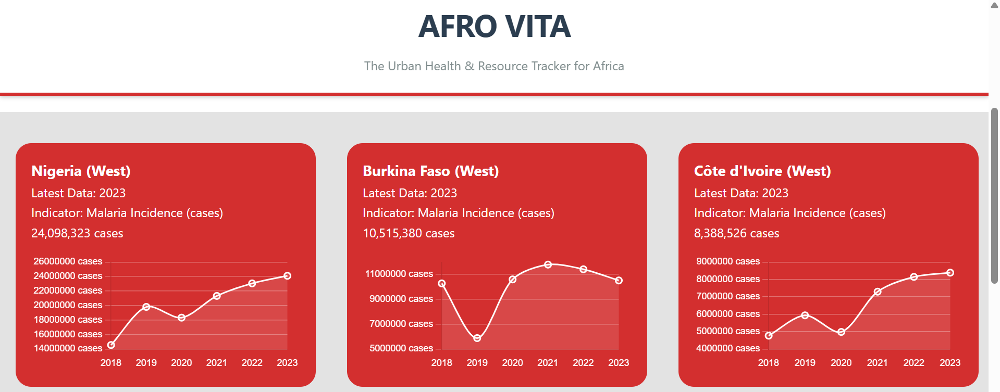
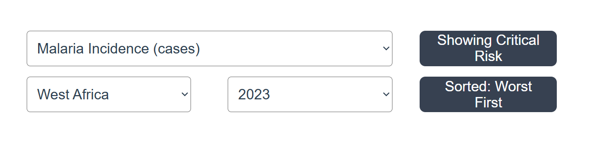
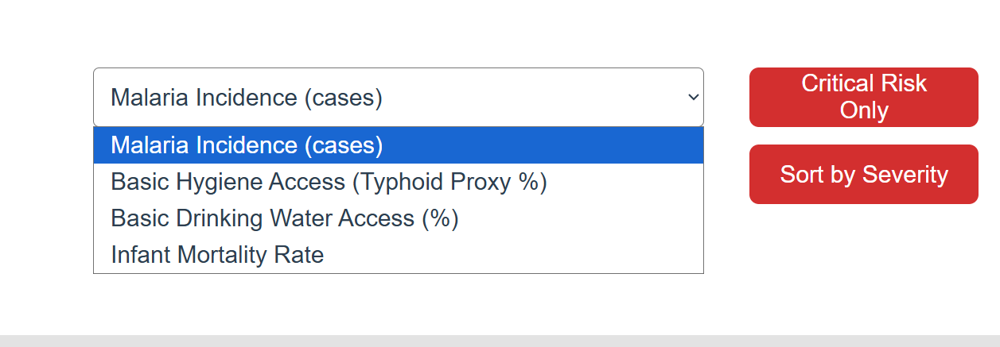
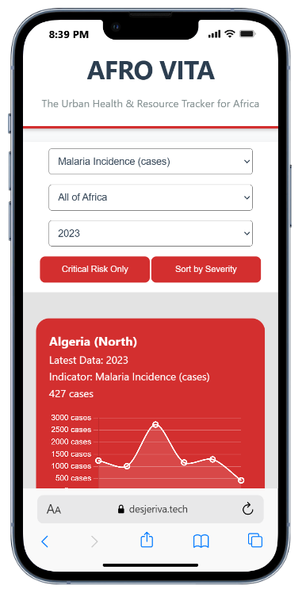
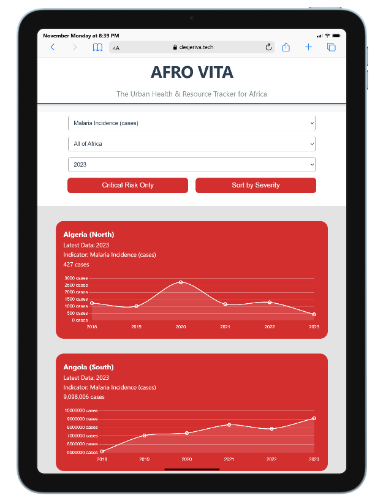
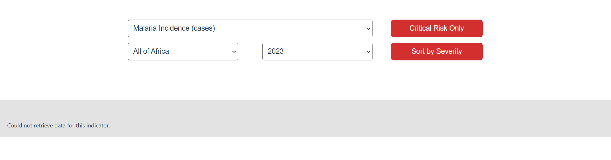

# AfroVita

## Project Overview

Afro Vita is a web application where organizations and individuals can get information about specific diseases that ara affecting each African country and how many people are affected. This allows humanitarian organizations, governments, Non-Governmental Organizations, and so on to know the numbers and dispatch aid and funding effectively and accordingly. It can also assist people in academia who want to conduct research. It makes the data from the World Bank API and makes it easy to view, by visualizing it in charts.

---

## Link to Demo Video


## Features

- Fetches health data from the World Bank APi and displays in a graphical form.
- User interactions:
  - Sorting data based on severity
  - Filtering results based on country and year
- Clear, easy-to-understand presentation of data
- Error handling for API downtime.

---

## Technologies Used

- Frontend: HTML, CSS, JavaScript
- API Used: World Bank API
- Web Servers: Nginx (web-01 and web-02)  
- Load Balancer: HAProxy (lb-01)

---

## UI Screenshots
### Header


### Data Visualization


### Filters and Sorting


### Various Health Indicators


### Mobile View


### Tablet View


 ---

## How I Deployed the Application to the Servers 

1. I SSHed into the web-01 and web-02 server with this command:
    ```bash
    ssh -i  ./school ubuntu@3.84.37.39(for web-01) / ubuntu@18.206.244.77 (For web-02)

2. I installed nginx on the webservers with this command:
    ```bash
        sudo apt update && sudo apt install nginx

3. I changed the web servers' (web-01 and web 02) html page from the default nginx html landing page to the files for my own project and put all my source code /var/www/html
4. I Configured the Nginx to serve the application:
    ```nginx
    server {
        listen 80 default_server;
        listen [::]:80 default_server;
        root /var/www/html;
        index index.html index.htm index.nginx-debian.html;
        server_name _;
        add_header X-Served-By web-01;

        location / {
                try_files $uri $uri/ =404;
        }
    }


## How I Configured the Load balancer to Serve the web-01 and web-02
1. I installed HAProxy in the Load balancer with this command: sudo apt update && sudo apt install haproxy -y|
2. I activated the haproxy with this code: sudo systemctl enable haproxy && sudo systemctl start haproxy

3. I configured my load balancer to distrubute traffic to the two web servers using round-robin by using this code:
    ```bash
        frontend http_front
            bind *:80
            default_backend web_servers

        backend web_servers
            balance roundrobin
            server web01 3.84.37.39:80 check (This is for web-01)
            server web02 18.206.244.77:80 check (This is for web-02)
4. I tested the distribution of the requests to the webservers, by using a for loop
    ```bash
        for i in {1..10}; do curl -sI http://54.236.227.220 | grep X-Served-By; done
    The output was an alternating X-Served-By-web-01, X-Served-By-web02...

5. I shut off the nginx on web-02 and then ran the for loop again to test if the load balancer will send all requests to the one that is working.

The load balancer sent the requests to only web-01 when web-02 was shut off.

This is the code that I used to do this after sshing to web-02: 
    ```bash
        sudo systemctl stop nginx

After I restarted the web-02 with this command: sudo systemctl start nginx, the Load balancer resumed the distribution of requests to the both servers.


### API Information
- API: World Bank Indicators API
- Documentation: [World Bank API](https://datahelpdesk.worldbank.org/knowledgebase/articles/889392-about-the-indicators-api-documentation)
- The API does not need API Keys.
- Errors are Handled: if API is down, the app used cached data or if there is no cached data, it displays "Could not retrieve data for this indicator".





## How to run the app locally- To clone the respository
1. In your terminal, run 
    ```bash
        git clone https://github.com/Jeremiah-J-Emmanuel/AfroVita.git

2. Enter into the directory: cd AfroVita

3. Open the file by running open ./index.html


## Notes about the Application
Because there are inconsistencies in data, especially data about Africa, some countries may be missing data for some years.
Countries that miss data for the entire timeline that we are recording which is from 2023-2018 will not be included when data is fetched.
Also, gaps in the data of countries between 2023 and 2018 will be represented with dotted lines on the graph.

## How to use the app.
There are four health indicators to choose from: Malaria, Typhoid Proxy, Infant Mortality, and Basic Drinking Water Access.
You can also make use of sorting and filters like sorting by 'Severity' which lists countries from worst to best, and the 'Critical Risk Only' filter which selects countries worse than the region's average.
You can also apply more than one filter.
